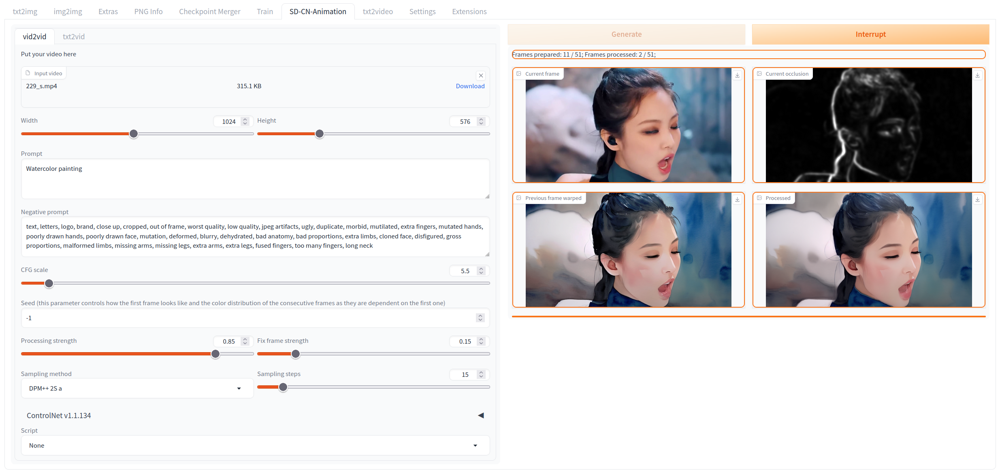

# SD-CN-Animation
This project allows you to automate video stylization task using StableDiffusion and ControlNet. It also allows you to generate completely new videos from text at any resolution and length in contrast to other current text2video methods using any Stable Diffusion model as a backbone, including custom ones. It uses '[RAFT](https://github.com/princeton-vl/RAFT)' optical flow estimation algorithm to keep the animation stable and create an occlusion mask that is used to generate the next frame. In text to video mode it relies on 'FloweR' method (work in progress) that predicts optical flow from the previous frames.

sd-cn-animation ui preview

Note: In vid2vid mode do not forget to activate any ControlNet model to achieve better results. Without it the resulting video might be quite choppy. I personally prefer to use 'hed' model with 0.65 control strength.

### Video to Video Examples:
</table>
<table class="center">
<tr>
 <td></td>
 <td></td>
 <td></td>
</tr>
<tr>
 <td width=33% align="center">Original video</td>
 <td width=33% align="center">"Jessica Chastain"</td>
 <td width=33% align="center">"Watercolor painting"</td>
</tr>
</table>

Examples presented are generated at 1024x576 resolution using the 'realisticVisionV13_v13' model as a base. They were cropt, downsized and compressed for better loading speed. You can see them in their original quality in the 'examples' folder. 

### Text to Video Examples:
</table>
<table class="center">
<tr>
 <td></td>
 <td></td>
 <td></td>
</tr>
<tr>
 <td width=33% align="center">"close up of a flower"</td>
 <td width=33% align="center">"bonfire near the camp in the mountains at night"</td>
 <td width=33% align="center">"close up of a diamond laying on the table"</td>
</tr>
<tr>
 <td></td>
 <td></td>
 <td></td>
</tr>
<tr>
 <td width=33% align="center">"close up of macaroni on the plate"</td>
 <td width=33% align="center">"close up of golden sphere"</td>
 <td width=33% align="center">"a tree standing in the winter forest"</td>
</tr>
</table>

All examples you can see here are originally generated at 512x512 resolution using the 'sd-v1-5-inpainting' model as a base. They were downsized and compressed for better loading speed. You can see them in their original quality in the 'examples' folder. Actual prompts used were stated in the following format: "RAW photo, {subject}, 8k uhd, dslr, soft lighting, high quality, film grain, Fujifilm XT3", only the 'subject' part is described in the table above.

## Installing the extension
To install the extension go to 'Extensions' tab in [Automatic1111 web-ui](https://github.com/AUTOMATIC1111/stable-diffusion-webui), then go to 'Install from URL' tab. In 'URL for extension's git repository' field inter the path to this repository, i.e. 'https://github.com/volotat/SD-CN-Animation.git'. Leave 'Local directory name' field empty. Then just press 'Install' button. Restart web-ui, new 'SD-CN-Animation' tab should appear. All generated video will be saved into 'stable-diffusion-webui/outputs/sd-cn-animation' folder.

## Last version changes: v0.8
* Better error handling. Fixes an issue when errors may not appear in the console.
* Fixed an issue with deprecated variables. Should be a resolution of running the extension on other webui forks.
* Slight improvements in vid2vid processing pipeline.
* Video preview added to the UI. It will become available at the end of the processing.
* Time elapsed/left indication added.
* Fixed an issue with color drifting on some models.
* Sampler type and sampling steps settings added to text2video mode.
* Added automatic resizing before processing with RAFT and FloweR models.